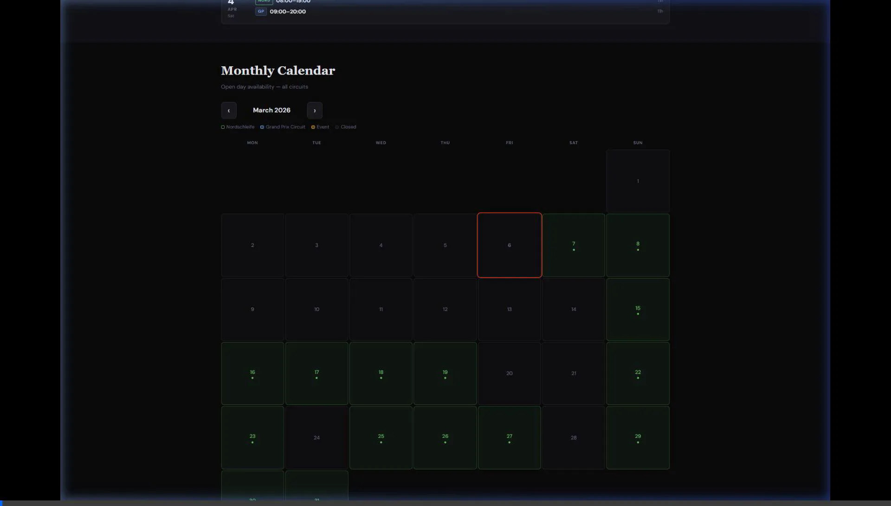

# Is The Ring Open? 🏁🏎️

[](https://istheringopen.com)
[](https://github.com/mjoliver/istheringopen/actions/workflows/firebase-hosting-merge.yml)

A lightweight, mobile-first community web app for checking the live status of the Nürburgring Nordschleife and Grand Prix Circuit, built specifically for unreliable trackside mobile networks.

<p align="center">
  
</p>

## Why this exists

You're driving out to the Ring, one bar of signal, and you just want to know: *is it open?* The official site loads slowly, the forum threads are outdated, and by the time you find the answer, you've missed the turn. 

This site answers that single question instantly. It fetches live data straight from the official API, caches it aggressively on your device using a Service Worker, and serves everything from a CDN. It loads instantly, even when the track is packed.

*   No ads
*   No tracking
*   No bloated JS frameworks
*   Just the answer

## Architecture

This project consists of two parts to ensure it scales for thousands of users without overwhelming the official API:

1.  **Frontend (Firebase Hosting):** 
    *   Vanilla HTML/CSS/JS with zero external dependencies.
    *   Service Worker caches the app shell locally.
    *   Opt-in only webcams to save mobile data (~400KB warning).
    *   `DM Sans` font subsetted and preloaded for performance.

2.  **API Proxy (Google Cloud Run):**
    *   A Node.js edge proxy that sits between the users and `nuerburgring.de`.
    *   If 10,000 people poll the site every 30 seconds, the proxy absorbs the load and only hits the official API **once per 30 seconds**.
    *   Adaptive caching: 30-second TTL when the track is open (to catch closures fast), 20-minute TTL when the track is closed.
    *   *(Note: The proxy source code is in the `/proxy` directory. Infrastructure decisions are kept private by the project owner).*

## Local Development

You don't need to run the proxy to develop the frontend locally — the `app.js` file will gracefully fall back to CORS proxies or direct fetching if the Cloud Run endpoint is unavailable.

Simply open `index.html` in your browser, or start a local Python server:

```bash
python -m http.server 3000
```

Then visit `http://localhost:3000`.

## License

This is a free, open-source community resource. The track data and webcam images belong exclusively to Nürburgring 1927 GmbH & Co. KG. Not affiliated with the official Nürburgring organisation.
