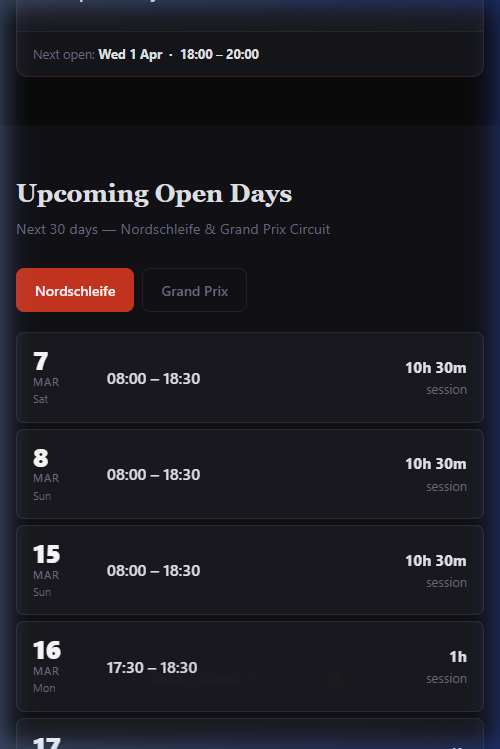

# istheringopen.com 🏁🏎️

[](https://istheringopen.com)
[](https://github.com/mjoliver/istheringopen/actions/workflows/firebase-hosting-merge.yml)

A lightning-fast, mobile-first web app for checking the live status of the Nürburgring Nordschleife and Grand Prix Circuit. Built specifically to work flawlessly on unreliable, congested trackside mobile networks in the Eifel.

<p align="center">
  
</p>

## The Problem

When the track is closed for a cleanup, it's a guessing game. You're sat with one bar of signal, trying to predict exactly when the barriers will lift. Get the timing right, and you're first out on a clear track; get it wrong, and you're buried in the access queue, destined for a lap full of traffic and frustration.

## The Solution

This app answers that single question instantly. 

- **Instant Load**: The entire app shell is cached locally on your device via a Service Worker.
- **Trackside Alerts**: Enable the notification bell to get a "pocket ping" the split-second the track flips from Closed to Open. Works in the background while you wait in the car.
- **Season Calendar Sync**: One-click export of the entire 12-month schedule to your Google/Apple calendar, including opening hours and events.
- **Adaptive Caching**: Background polling adjusts based on the schedule — 30s when live or opening within an hour, 10m if opening later today, 1h if tomorrow, 12h if within the week, 24h in deep off-season.
- **Optimised for congested networks**: ~20 KB total on the wire. Zero external requests — no third-party fonts, trackers, or CDN calls. Single upstream API call shared across all users.
- **No bloat**: Pure HTML, CSS, and JS. No massive frameworks, no ads, no trackers. *Just the answer.*

## Architecture

To ensure it scales for thousands of users simultaneously without overwhelming the official Nürburgring API, the project uses a custom two-part serverless architecture:

1.  **Frontend (Firebase Hosting):** 
    *   Serves the static assets via Google's global CDN.
    *   Uses a Service Worker for aggressive offline caching.
    *   Custom `DM Sans` font subsetted and preloaded for immediate rendering.

2.  **API Proxy (Google Cloud Run):**
    *   A Node.js edge proxy that sits between the users and `nuerburgring.de`.
    *   If 10,000 people open the app at exactly the same time, the proxy absorbs the load and only hits the official Nürburgring API **once per 30 seconds**.
    *   Automatically spoofs headers to securely fetch protected endpoints without triggering Cloudflare blocks.

## Local Development

You don't need to run the proxy to develop the frontend locally — the `app.js` file handles the fallback logic gracefully.

1. Clone the repository.
2. Start any local web server in the project directory:

```bash
python -m http.server 3000
```

3. Visit `http://localhost:3000`.

## License & Data Sourcing

This is a free, open-source community resource built by and for motorsport fans. 

* The track schedule, live data, and webcam snapshots remain the property of **Nürburgring 1927 GmbH & Co. KG**. 
* This project is completely independent and is not affiliated with the official Nürburgring organisation.
